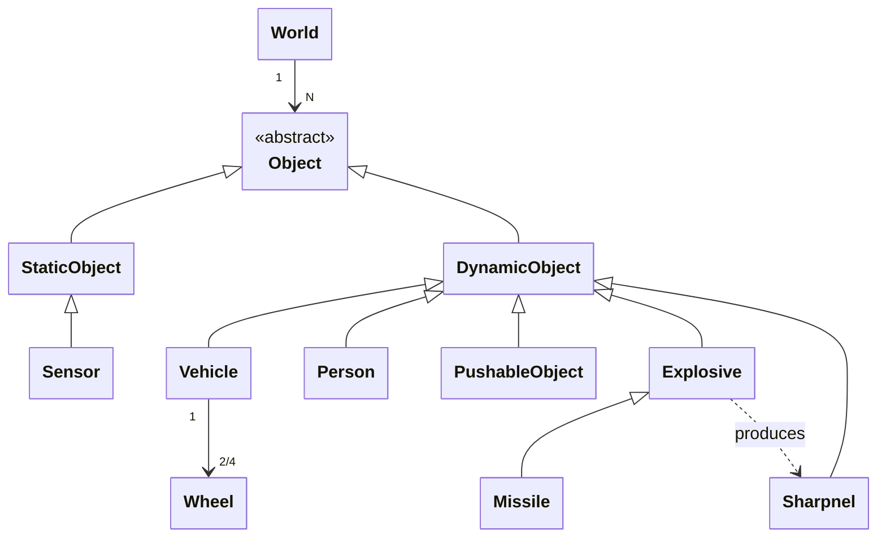

## Class diagram

```mermaid
---
  config:
    class:
      hideEmptyMembersBox: true
---
classDiagram
    World "1" --> "N" Object
    Object <|-- StaticObject
    StaticObject <|-- Sensor
    Object <|-- DynamicObject
    DynamicObject <|-- Vehicle
    DynamicObject <|-- Person
    DynamicObject <|-- PushableObject
    DynamicObject <|-- Explosive
    Explosive <|-- Missile
    DynamicObject <|-- Sharpnel
    Explosive ..> Sharpnel : produces
    Vehicle "1" --> "2/4" Wheel
    
    <<abstract>> Object
```